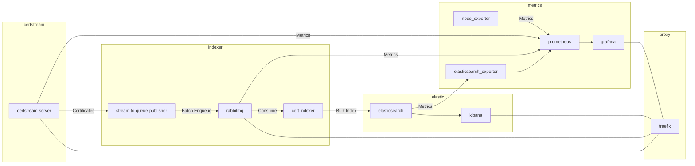

# 📜🌊🔍 Certstream Analyser

## 🏗️ Components
This chart shows all components and the flow of data. Each rectangle represents a docker network in which services are encapsulated. Services are only exposed through the proxy. Please note that node-exporter must use a host binding in order to collect metrics for all network interfaces. You should block access to port `9100` with a firewall.


### Prerequisites
Make sure the following docker networks exist before starting the individual services:
- certstream
- elastic
- metrics
- proxy

Recommended startup order:
1. traefik
2. elastic
3. certstream
4. indexer
5. metrics

### 🌊 certstream
No further configuration is required and this service can be started independently of all other services:
```sh
cd certstream
docker compose up -d

# query metrics manually
docker run --rm --network=certstream curlimages/curl:latest -s http://certstream-server:8080/metrics
```

### 🔎 elastic
Required configuration in `.env`:
```ini
# Password for the 'elastic' user (at least 6 characters)
ELASTIC_PASSWORD=""
# Password for the 'kibana_system' user (at least 6 characters)
KIBANA_PASSWORD=""

# generated with kibana-encryption-keys generate:
# docker run --rm docker.elastic.co/kibana/kibana:8.14.2 kibana-encryption-keys generate
KIBANA_ENCRYPTED_SAVED_OBJECTS_KEY=""
KIBANA_REPORTING_KEY=""
KIBANA_SECURITY_KEY=""

STACK_VERSION=8.14.2
CLUSTER_NAME=docker-cluster
LICENSE=basic
ES_PORT=9200
```
This service can be started independently of all other services:
```sh
cd elastic
docker compose up -d

# copy CA certificate from container to host
docker compose cp es01:/usr/share/elasticsearch/config/certs/ca/ca.crt .
```

### 🐇 indexer
Setup the python environment:
```sh
# create virtual environment
python3 -m venv .venv
# activate virtual environment
source .venv/bin/activate

# install dependencies
pip install --upgrade -r indexer/requirements-dev.txt
pip install --upgrade -r indexer/cert-indexer/requirements.txt
pip install --upgrade -r indexer/stream-to-queue-publisher/requirements.txt

# install pre-commit hooks
pre-commit install
```

Required configuration in `.env`:
```ini
BATCH_SIZE=100
CERTSTREAM_URL="ws://certstream-server:8080/full-stream"
CTLOG_INDEX_NAME="ctlog-prod"
DOMAIN=""
ELASTIC_API_KEY=""
ELASTIC_CA_FILE="ca.crt"
ELASTIC_URL="https://es01:9200"
RABBITMQ_HOST="rabbitmq"
RABBITMQ_PASSWORD=""
RABBITMQ_QUEUE_NAME="ctlog"
RABBITMQ_USER=""
```

This service requires the services `certstream` and `elastic` to be up and running. You will also need to copy the elastic CA certificate to `indexer/cert-indexer/ca.crt` and create an elasticsearch API key.
```sh
cd indexer
docker compose up -d
```

### ⏱️ metrics
Required configuration in `.env`:
```ini
DOMAIN=""
GF_SECURITY_ADMIN_USER=""
GF_SECURITY_ADMIN_PASSWORD=""
GF_SMTP_HOST=""
GF_SMTP_USER=""
GF_SMTP_PASSWORD=""
GF_SMTP_FROM_ADDRESS=""
# Password for the 'elastic' user in order
# for elasticsearch_exporter to fetch metrics
ELASTIC_PASSWORD=""
```

This service can be started independently of all other services, however, it is recommended to start the `certstream`, `indexer` and `elastic` service first as this service collects metrics from them.
```sh
cd metrics
docker compose up -d

# reload prometheus configuration
docker run --rm --network=metrics curlimages/curl:latest -X POST -si http://prometheus:9090/-/reload
```

### 🚦 traefik
Required configuration in `.env`:
```ini
# configuration for ACME (Let's Encrypt email and CF credentials for DNS challenge)
# You have to adjust this for your needs/setup
LE_EMAIL=""
CF_API_EMAIL=""
CF_API_KEY=""
```

This service can be started independently of all other services:
```sh
cd traefik
docker compose up -d
```

## 📊 Performance Measurements
Python script which connects to the websocket of the certstream-server to measure certificate throughput.
```sh
docker build --no-cache -t certstream-stats ./performance-measurements
# perform 10 measures
docker run --rm -it --network certstream certstream-stats 10
```
Example output
```
Performing 10 measurements on batches of 1000 certificates
Connected to ws://certstream-server:8080/full-stream
[   1/10]  212c/s  1.83MB/s (avg size: 8652B σ=662)
[   2/10]  226c/s  1.99MB/s (avg size: 8784B σ=690)
[   3/10]  226c/s  1.99MB/s (avg size: 8806B σ=737)
[   4/10]  326c/s  2.86MB/s (avg size: 8765B σ=746)
[   5/10]  225c/s  1.98MB/s (avg size: 8803B σ=752)
[   6/10]  261c/s  2.30MB/s (avg size: 8808B σ=722)
[   7/10]  172c/s  1.50MB/s (avg size: 8711B σ=735)
[   8/10]  173c/s  1.54MB/s (avg size: 8869B σ=875)
[   9/10]  178c/s  1.55MB/s (avg size: 8750B σ=779)
[  10/10]  269c/s  2.38MB/s (avg size: 8865B σ=742)

  Statistics for 10 measurements on batches of 1000 certificates   
┏━━━━━━━━━━━━━━━━━━━━━━━┳━━━━━━┳━━━━━━┳━━━━━━┳━━━━━━┳━━━━━━┳━━━━━━┓
┃ Metric                ┃ Unit ┃  Avg ┃  Std ┃  Med ┃ 95th ┃ 99th ┃
┡━━━━━━━━━━━━━━━━━━━━━━━╇━━━━━━╇━━━━━━╇━━━━━━╇━━━━━━╇━━━━━━╇━━━━━━┩
│ Certificate rate      │ c/s  │  227 │   46 │  226 │  301 │  321 │
│ Message size          │ Byte │ 8781 │   63 │ 8793 │ 8868 │ 8869 │
│ Data rate             │ MB/s │ 1.99 │ 0.41 │ 1.99 │ 2.65 │ 2.82 │
│ Max. time/certificate │ ms   │ 4.41 │      │ 4.43 │ 3.33 │ 3.11 │
└───────────────────────┴──────┴──────┴──────┴──────┴──────┴──────┘

Start time: 2024-06-13 12:24:25 UTC
End time:   2024-06-13 12:25:11 UTC
Duration:   45.84s
```

## 🧰 Tools
The `tools` subdirectory contains multiple helpful tools to list available CT logs, fetch entries from a CT log and generate graphs based on statistical data pulled from elasticsearch. Apart from the log tool these tools were primarily developed for the purpose to generate graphics for my thesis I wrote about this project. You may have to adjust them according to your needs.
```sh
# Setup
python3 -m venv .venv --upgrade-deps
pip install --upgrade -r requirements.txt
pip install --upgrade -r requirements-dev.txt
pre-commit install

# Run formatter
black .
isort --profile black .
```

### 📃 Log tool
Fetches logs acknowledged by Google or Apple:
```
usage: log_tool.py [-h] [-l {google,apple}]

options:
  -h, --help            show this help message and exit
  -l {google,apple}, --list {google,apple}
                        List to fetch CT logs from
```

### 🔮 Fetch entries
Fetches one or more entries from a CT log
```
usage: fetch_entries.py [-h] -u URL -s START -e END

options:
  -h, --help            show this help message and exit
  -u URL, --url URL     Base URL of the log with trailing slash
  -s START, --start START
                        Start index
  -e END, --end END     End index
```

Example usage to fetch a single entry with the entry number `1787018554` from Googles Xenon 2024 log:
```sh
python3 fetch_entries.py -u https://ct.googleapis.com/logs/eu1/xenon2024/ -s 1787018554 -e 1787018554
```

### 📈 Stats & Disk space
The `stats.py` script generates plot for various statistical data fetched from elasticsearch based on the indexed PrecertLogEntries and X509LogEntries.
```
usage: stats.py [-h] [-i] [-d] [-f {png,pdf}]

options:
  -h, --help            show this help message and exit
  -i, --interactive     Show interactive plots
  -d, --debug           Activate debug logging
  -f {png,pdf}, --format {png,pdf}
                        Output format
```

The `disk_space.py` utility currently uses hardcoded values on average certificate issuance rates and how many byte of storage is needed for a single certificate to calculate different scenarios of disk space usage.
